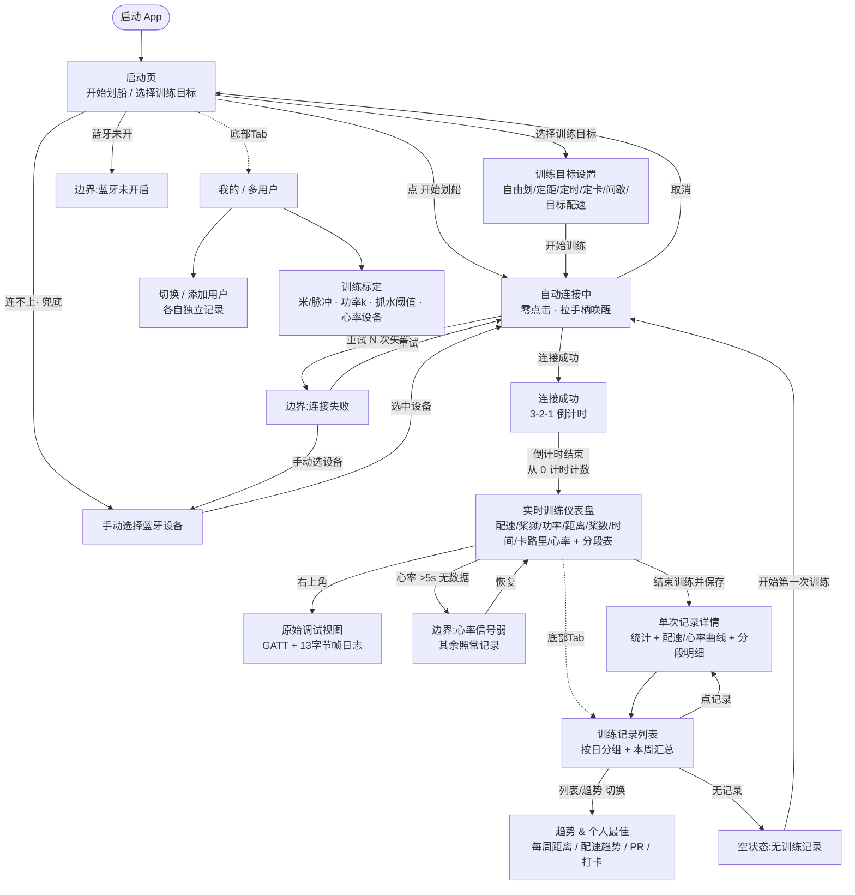
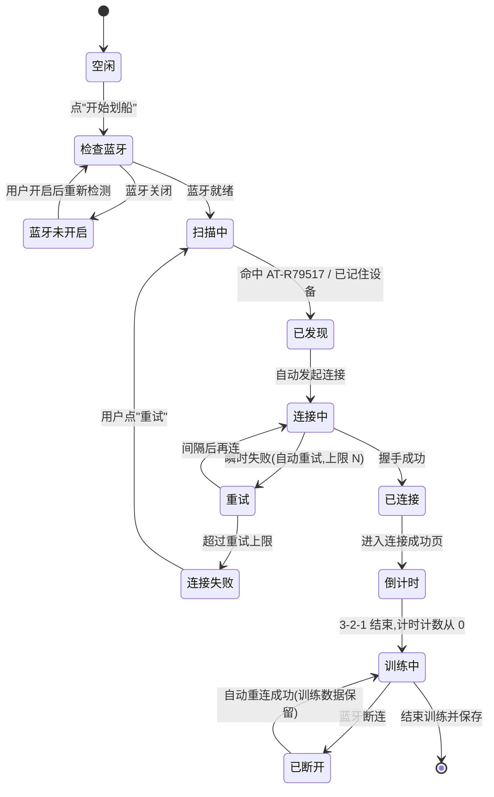
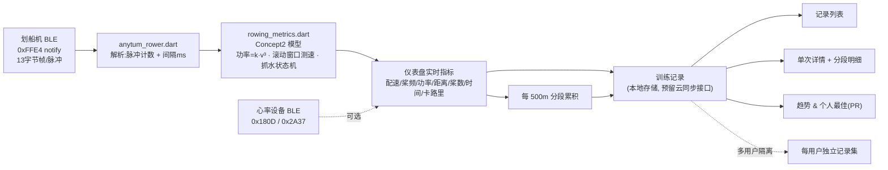

# 小莫划船机 App · 流程图

> 版本 v0.3 · 2026-05-17 · 配套 `prototype/index.html` / `docs/PRD.md`
> 使用 Mermaid,GitHub 直接渲染。

---

## 1. 总导航与训练主流程

底部 Tab(训练 / 记录 / 我的)在所有可浏览页常驻且全程可点;**专注流程**(自动连接中、连接成功倒计时、连接失败)隐藏 Tab,避免误触中断。

## 2. 连接生命周期状态机

## 3. 一次训练的数据流

> 关键不变量:距离 = 累计脉冲 × 米/脉冲(默认 0.45,可标定);计时计数**连接成功后从 0**;卡路里为无参照估算;同一次训练在仪表盘/详情/列表/分段/原始日志间数字一致。
